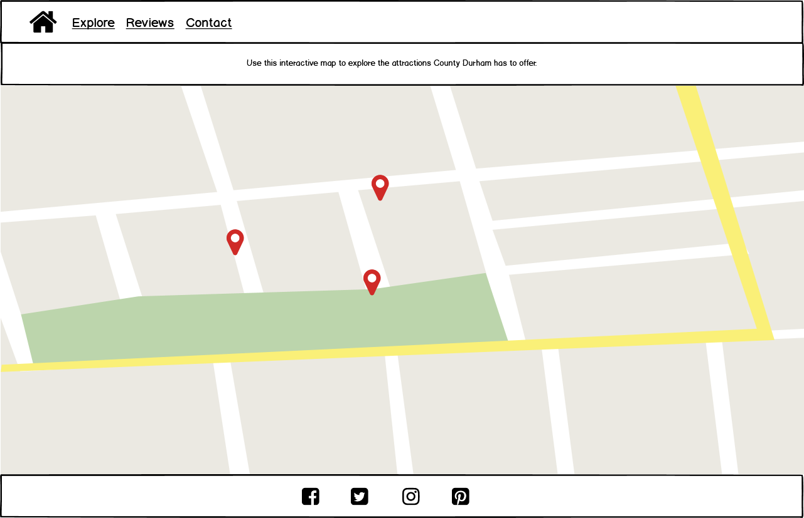
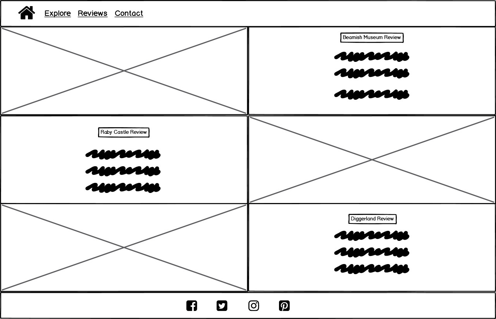
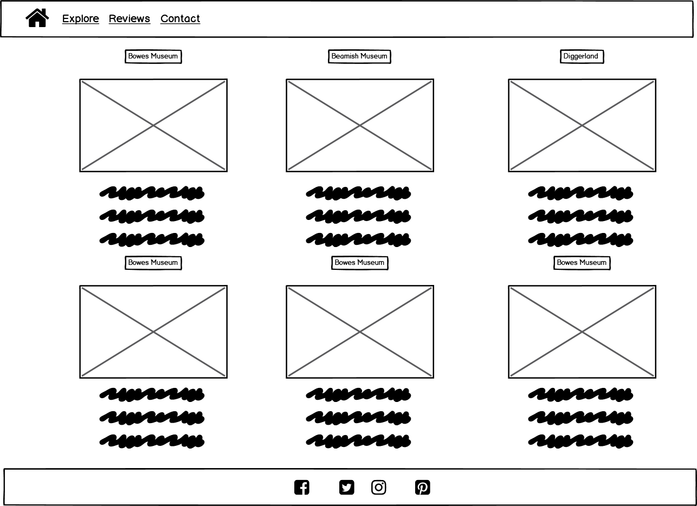
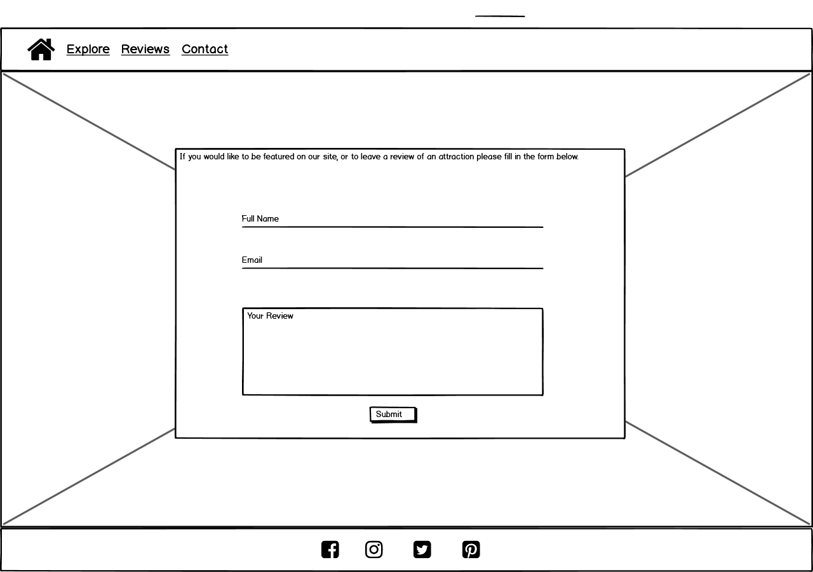
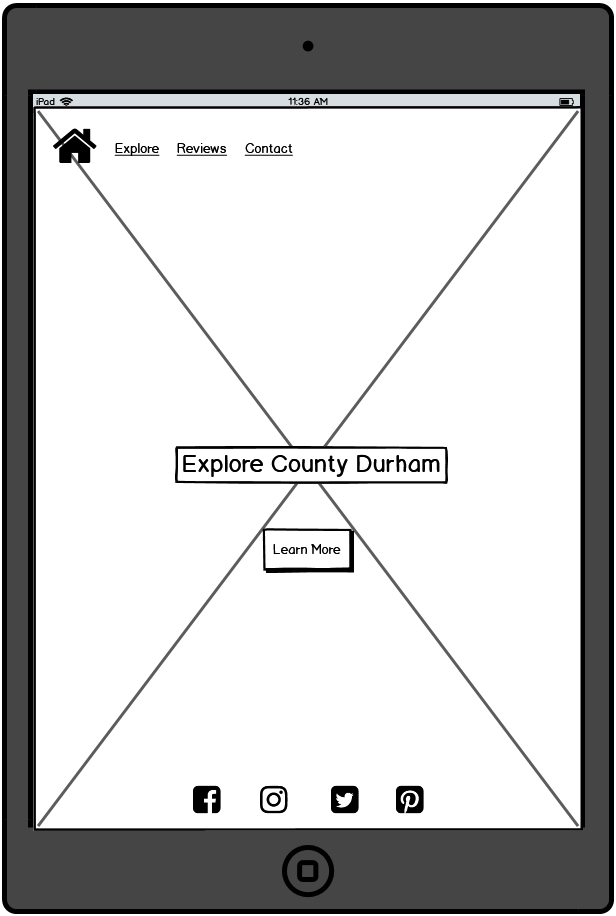
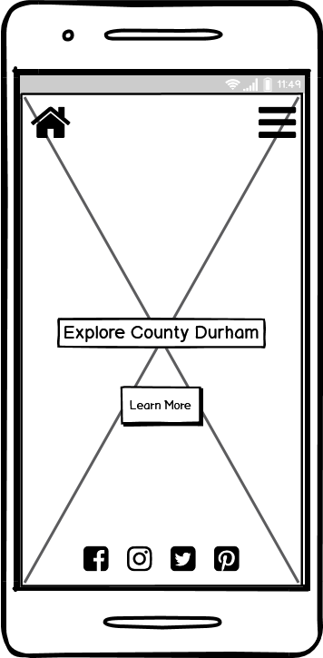
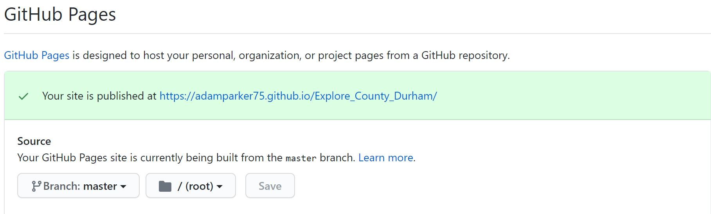
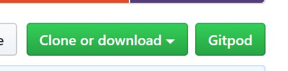

# _**Explore County Durham**_

This website was designed to allow people to explore the wonderful area that I live in. The home page features
a little bit of information about County Durham and an option for users to click a button which will take them to an interactive map. 
The map was designed with markers added of a number of attractions around the county. When the marker is clicked an ino window appears
giving the user further information about the attraction.  
The site also features a contact form for people to leave reviews about the places they have visitied and also request for their attraction to be
featured on the website. There is also a reviews page to allow users to read about what people think of the attractions and help them choose where to visit.

The deployed website can be viewed here  - [Explore County Durham](https://adamparker75.github.io/Explore_County_Durham/).

## _**UX**_

I created the website with a main landing page and an image of the iconic Durham cathedral. I wanted this page to 
be quite simple and let the image be the main feature.  
I designed the site with a mobile first approach, I wanted it to easy to navigate and created a similar structure to each page by replicating 
the header and footer across all pages.  
The colours for the site were chosen, as blue and yellow is the colour of the flag for County Durham.

### _**Target Audience**_

The website is aimed at but not limited to the following users :

* Visitors to the area.
* People local to the area.
* Families planning days out.
* People who own / manage attractions.
* Tourists from abroad.
* People who want to read reviews about the attractions.

### _**User Stories**_

As someone visiting the area for the first time, I want to see what sort of attractions are on offer, so that I can plan my trip.

As someone living in the area, I want to see if there are any places I haven't visited before, so that I can plan a day out.

As a parent, I want to see what family friendly places there are to visit, so I can plan a fun day out.

As someone trying to decide whether to visit one of the attractions, I want to read some reviews from other people, so that I can make an informed decison.

As someone who wants to help other people decide whether to visit an attraction, I want to be able to leave a review, so that other people can read it on the site and decide if they want to visit.

As someone who owns / manages an attraction, I want to be able to submit my details, so that I can request my attraction to be featured.

As someone who uses social media, I want to be able to find social media pages related to County Durham, so that I can follow any of interest to me. 

## _**Wireframes**_

### _**Home Page**_

  

### _**Attractions Page**_

  

### _**Reviews Page**_

  

I decided to change the layout of the reviews page as I found it didn't suit the needs of what I was trying to achieve, below is the new wireframe.

  

### _**Contact Page**_

  

### _**Tablet View**_

  

### _**Smartphone View**_

  

## _**Features**_

* **Navigation Bar** - The navigation bar is easy to use and consistent across the site, it is designed responsively and collapses down on smaller devices.
* **Footer Links** - Allows the user to link to various social media pages when clicked.
* **Jumbotron** - The jumbotron pops up after users have clicked learn more on the homepage. It gives users information about the County and it's attractions
and encourages the user to explore the interactive map.
* **Interactive Map** - A map with clickable markers allows users to explore the attractions on offer in the county.
* **Marker Info Window** - An info window appears above each marker when clicked, this gives users more information about each attraction.
* **Contact Form** - Allows users to submit their information if they would like their attraction to be featured on the site.
* **Favicon** - Allows users to identify the site in their open browser tabs.

### _**Features left to implement**_

* To be able to search for an attraction and read the reviews.
* Add a filter option onto the map to include for example family friendly or disabled access.
* Add hotels or restaurants close to the attractions. 
* Widen the search area to include the whole of the North East, not just County Durham.

## _**Technologies Used**_

[HTML](https://en.wikipedia.org/wiki/HTML5) - HTML provides the content and structure for my website

[CSS](https://en.wikipedia.org/wiki/Cascading_Style_Sheets) - CSS provides the styling.

[Bootstrap](https://getbootstrap.com/) - The Bootstrap framework was used to create the layout for all of the pages. It was also used for the responsive navigation bar.

[Google Fonts](https://fonts.google.com/) - I used the Allegraya and Lato fonts on each of my pages.

[Font Awesome](https://fontawesome.com/) - I used the font awesome icons to style the links in the footer.

[jQuery](https://jquery.com/) - jQuery was used to toggle in the Jumbotron and its elements.

[javaScript](https://www.javascript.com/) - javaScript was used for the google maps api and the Emailjs api.

[Google Maps Api](https://developers.google.com/maps/documentation/javascript/overview) - Google maps Api was used to create the interactive map.

[Email Js](https://www.emailjs.com/) - Email JS was used to send an email when the contact form has been submitted.

## _**Testing**_

I carried out a lot of testing using the developer tools in Google Chrome, I did this to ensure the site worked well on smaller devices
and to make sure the website was responsive. I also used tools like [JSHint](https://jshint.com/) and [W3C Markup Validation Service](https://validator.w3.org/) to ensure my
code was correct and had no errors.

### _**User Story Tests**_

1. **First Time Visitor**

i.    Click the **learn more** button on the home page.  
ii.   Does the jumbotron appear?  
iii.  Is the text in the jumbotron clear and easy to read?  
iv.   Click the **click here** button.  
v.    Does the explore page open?  
vi.   Does the map load and are the markers visible?  
vii.  When the markers are clicked does an info window appear?  
vii.  Is the text visible and easy to read? 

**All tests performed and no errors found.**

2. **Person from the local area**

i.    Click on the explore link in the navigation bar.
ii.   Does the explore page open?  
iii.  Does the map load and are the markers visible?  
iv.   When the markers are clicked does an info window appear?  
v.    Is the text visible and easy to read? 

**All tests performed and no errors found.**

3. **Parent**

i.    Click on the explore link in the navigation bar.  
ii.   Does the explore page open?  
iii.  Does the map load and are the markers visible?  
iv.   When the markers are clicked does an info window appear?  
v.    Is the text visible and easy to read? 
vi.   Is there enough information about the attraction for someone to know if it is family friendly?  

**All tests performed and no errors found.**

4. **Reviews Page**

i.    Click on the reviews link in the navigation bar.  
ii.   Does the reviews page open?  
iii.  Is the user able to distinguish between the different attractions>  
iv.   Does an image of each attraction appear?  
v.    Is the text below the image clear and easy to read?  
vi.   If I hover over an image does another review appear and the previous review disappear? 

**All tests performed and no errors found.**

5. **Leave a review / submit details**

i.    Click on the contact link in the navigation bar.  
ii.   Does the contact page appear?  
iii.  Click the submit button to submit a blank form, does the required field message apear?  
iv.   Test the email field with an incorrect email address, can the form be submitted?  
v.    Place 10 characters in the text box and press submit. Do you get a message about the minimum number of characters? 
vi.   Fill out all the fields correctly and click submit, can the form be submitted? 
vii.  Does the form clear after it has been submitted?  
viii. Does an alert appear to say your request has been sent after the form is submitted?  
ix.   Is an email received with the details submitted in the form?

**All tests performed and no errors found.**

6. **Social Media links**

i.    Are the social media links visible on the home page?  
ii.   Click on the explore, reviews and contact pages, are the social media links visible on both of these pages?  
iii.  On each of the pages, home page, explore, reviews and contact page, click the facebook social media link, does facebook open?  
iv.   On each of the pages, home page, explore, reviews and contact page, click the twitter social media link, does twitter open?  
v.    On each of the pages, home page, explore, reviews and contact page, click the istagram social media link, does instagram open?  
vi.   On each of the pages, home page, explore, reviews and contact page, click the pinterest social media link, does pinterest open?  

**All tests performed and no errors found.**

**I tested the website on the following browsers using a Microsoft Surface Pro on Windows 10 pro.**

* Google Chrome - Version 84.0.4147.105 (Official Build) (64-bit)
* Microsoft Edge - Version 84.0.522.52 (Official build) (64-bit)
* Mozilla Firefox - 79.0 (64-bit)

The website worked very well on all of these browsers. The map loaded and markers and info windows appeared. The reviews changed if I hovered over an image on each browser. 
The contact form worked correctly, and all social media links worked correctly.

**I tested the website on a number of devices as listed below**

Google Pixel 3 xl using Google Chrome on Android 10.

Moto E5 using using Google Chrome on Android 8.1.

Ipad 6th Generation using Safari on IOS 13.4.

Iphone 8 using Safari on IOS 13.4.

**I used the following websites for validation of my code**

[HTML validation.](https://validator.w3.org/)

[CSS validation.](https://jigsaw.w3.org/css-validator/)

[JavaScript validation.](https://jshint.com/)

### _**Issues found in testing**_

1. The text on the jumbotron overflowed the container when viewed on smaller devices. To fix this I created 
a media query to reduce the font size down at a certain screen size.

2. The image on the home page took a long time to load when opening the home page for the first time. This was due to the 
size of the image. I resolved this by using an [image compressing tool](https://compressimage.toolur.com/) to reduce the size of 
the image and increase the load time.

3. The text on the navigation bar when collapsed, over lapped some of the content on the pages. I created a media query to reduce
the font size when viewed on smaller devices.

4. The images in the info windows on the google map were far too large causing the info window to scroll to the right to view
the whole image. To resolve this I resized the images and made them 75% of the container, which made them responsive when viewed on smaller devices.

### _**Not yet resolved**_

1. ~~When viewing the contact form through the dev tools, if you select Iphone 5 / SE, the bottom of the contact form overlaps the footer. This is the only device
that this happens on, I have tried to add padding through a media query and also tried making the footer fixed, but this still does not resolve the issue. As this is 
only one device I will continue to work on a resolution.~~
  **This has now been resolved by adding a media query to reduce the padding-top of the heading at the top of the page to 1.8rem.**

2. When viewing the contact form on a mobile device. When the keyboard appears to type into the text box,
some white space appears at the bottom of the screen. This does not happen when viewed in Dev tools and I am still looking at a way to resolve this."

## _**Deployment**_

My website is hosted on GitHub Pages, to access the website please take the following steps.

### _**GitHub Pages**_

1. Navigate to my Github repository - <https://github.com/adamparker75/Explore_County_Durham>
2. Click on the **settings** tab at the top of the page.
3. Scroll down to the **GitHub Pages** section.
4. Change the source to **master branch**.
5. After selecting master branch the page will refresh.
6. Scroll down to the GitHub Pages section and a green box saying **"your site is published at"** will appear.
7. Click the link to go to the published website.

 

  

You can view the deployed website here - [Explore County Durham](https://adamparker75.github.io/Explore_County_Durham/)

### _**Git Clone**_

1. Navigate to my Github repository - <https://github.com/adamparker75/Explore_County_Durham>
2. Click the green drop down that says clone or download.

 

  

3. To clone with HTTPS copy the URL in the box. <https://github.com/adamparker75/Explore_County_Durham.git>
4. Open up your preferred IDE (Integrated Development Environment)
5. Change the directory to the location you want the clone to be made.
6. Type **git clone** and then paste the copied URL from step 3.
7. Press Enter and your local clone will be created.

## _**Credits**_

### _**Content**_

* The code for the navbar on all pages was copied from [w3schools](https://www.w3schools.com/bootstrap4/bootstrap_navbar.asp).
* The code for the main backgrouns image on the home page was copied from [w3schools](https://www.w3schools.com/css/css3_backgrounds.asp).
* The code for the jumbotron information section on the home page was taken from [Bootstrap](https://getbootstrap.com/docs/4.4/components/jumbotron/).
* The contact form was designed with the help from [Stack Overflow](https://stackoverflow.com/questions/31294236/responsive-form-on-top-of-responsive-image-bootstrap).
* The JavaScript code for the **Email Js** api, was taken from [The code Institute](https://courses.codeinstitute.net/program/FullstackWebDeveloper) interactive front end module.
* The JavaScript code for the **Google Maps** api was created with help from [ASP Snippets](https://www.aspsnippets.com/Articles/Google-Maps-API-V3-Add-multiple-markers-with-InfoWindow-to-Google-Map.aspx//) and [Stack Overflow](https://stackoverflow.com/questions/63131682/adding-opening-hours-to-google-maps-info-window).
* The code for the overlay and spinner on the contact page were copied from [JS fiddle](https://jsfiddle.net/mshaker88/u41rgq3e/).
* The colours used on the website were chosen from [Adobe](https://color.adobe.com/create/color-wheel/).
* The wireframes were created with [Balsamiq](https://balsamiq.com/).
* The favicon was created on [favicon-generator](https://www.favicon-generator.org/).

### _**Media**_

* All of the images used on the site were taken from [Google Images](https://www.google.com/imghp?hl=EN).
* All of the reviews on the reviews page were taken from [Trip Advisor](https://www.tripadvisor.co.uk/#).
* The information about each attraction was taken from [This is Durham](https://www.thisisdurham.com/).

### _**Acknowledgements**_

* To my wife **Claire Parker** for helping me test the website.
* To my mentor **Reuben Ferrante** for being a great help and providing excellent help and guidance through the process.

