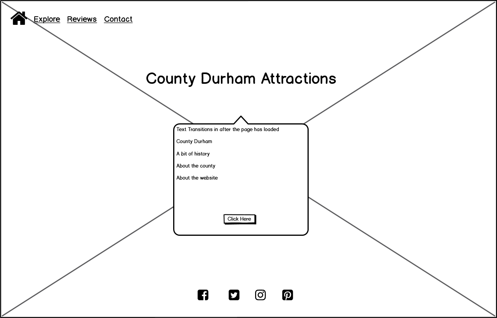

# _**Explore County Durham**_

This website was designed to allow people to explore the wonderful area that I live in. The home page features
a little bit of information about County Durham and an option for users to click a button which will take them to an interactive map. 
The map was designed with markers added of a number of attractions around the county. When the marker is clicked an ino window appears
giving the user further information about the attraction.  
The site also features a contact form for people to leave reviews about the places they have visitied and also request for their attraction to be
featured on the website. Their is also a reviews page to allow users to read about what people think of the attractions and hekp them choose where yto visit.

The deployed website can be viewed here  - [Explore County Durham](https://adamparker75.github.io/Explore_County_Durham/).

## _**UX**_

I created the website with a main landing page and an image of the iconic Durham cathedral. I wanted this page to 
be quite simple and let the image be the main feature.  
I designed the site with a mobile first approach, I wanted it to easy to navigate and created a similar structure to each page by replicating 
the header and footer across all pages.  
The colours for the site were chosen, as blue and yellow is the colour of the flag for County Durham.

### _**Target Audience**_

The website is aimed at but not limited to the following users :

* Visitors to the area.
* People local to the area.
* Families planning days out.
* People who own / manage attractions.
* Tourists from abroad.

### _**User Stories**_

As someone visiting the area for the first time, I want to see what sort of attractions are on offer, so that I can plan my trip.

As someone living in the area, I want to see if there are any places I haven't visited before, so that I can plan a day out.

As a tourist from abroad, I want to see what the area has to offer, so that I can decide to visit or not.

As a parent, I want to see what family friendly places there are to visit, so I can plan a fun day out.

As someone trying to decide whether to visit one of the attractions, I want to read some reviews from other people, so that I can make an informed decison.

As someone planning a trip I want so see where the attractions are located, so that I can plan my journey.

As someone who owns / manages an attraction, I want to be able to submit my details, so that I can request my attraction to be featured.

## _**Wireframes**_

### _**Home Page**_

  

### _**Attractions Page**_

  

### _**Reviews Page**_

  

### _**Contact Page**_

  

### _**Tablet View**_

  

### _**Smartphone View**_

  

